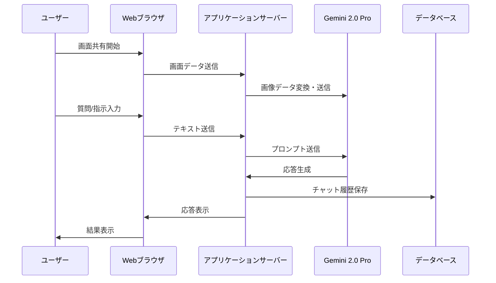

# データフロー

```mermaid
sequenceDiagram
participant User as ユーザー
participant Browser as Webブラウザ
participant Server as アプリケーションサーバー
participant LLM as Gemini 2.0 Pro
participant DB as データベース
User->>Browser: 画面共有開始
Browser->>Server: 画面データ送信
Server->>LLM: 画像データ変換・送信
User->>Browser: 質問/指示入力
Browser->>Server: テキスト送信
Server->>LLM: プロンプト送信
LLM->>Server: 応答生成
Server->>DB: チャット履歴保存
Server->>Browser: 応答表示
Browser->>User: 結果表示
```
