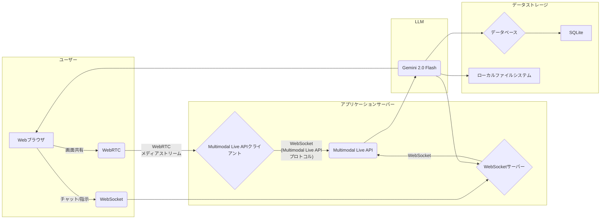

# システムアーキテクチャ

**コンポーネントの説明:**

*   **A (Web ブラウザ):** ユーザーインターフェース。WebRTC による画面共有、WebSocket によるチャット/指示を行う。
*   **B (WebRTC):** ブラウザの WebRTC API を使用して、画面共有のメディアストリームを取得。
*   **C (WebSocket):** ブラウザの WebSocket API を使用して、チャット/指示を WebSocket サーバーに送信。
*   **D (Multimodal Live API クライアント):** WebRTC メディアストリームを受信し、WebSocket 経由で Multimodal Live API に送信。
*   **E (WebSocket サーバー):** Web ブラウザからの WebSocket 接続を処理し、チャット/指示を Multimodal Live API に転送。
*   **H (Multimodal Live API):** Google が提供する API。マルチモーダルな入力を処理し、Gemini 2.0 Flash モデルにアクセス。
*   **I (Gemini 2.0 Flash):** Google が提供する高速な推論が可能な大規模言語モデル。
*   **J (データベース):** SQLite を使用して、構造化データ (ユーザー情報、セッション情報など) を保存。
*   **K (SQLite):** 軽量なファイルベースのデータベース。
*   **L (ローカルファイルシステム):** Gemini 2.0 Flash が生成したテキスト、画像などのコンテンツを保存。
