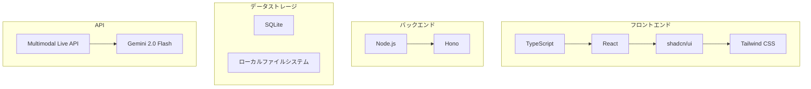

# 技術スタック

このドキュメントでは、採用する技術とその選定理由について説明します。

## 検討のポイント

*   **フルスタック TypeScript:** フロントエンド、バックエンド、API クライアントの全てを TypeScript で記述し、型安全性と開発効率を高める。
*   **シンプルさ:** 個人用途での開発・運用を容易にするため、構成要素を最小限にし、依存関係を減らす。
*   **モダンな Web 開発:** コンポーネントベースの UI 開発、宣言的な UI 記述、高速なビルドなど、モダンな Web 開発のプラクティスを取り入れる。
*   **高速性:** ユーザー体験を向上させるため、高速なランタイム、ビルドツール、ライブラリを選択する。
*   **個人用途:** 低コストで、学習コストが低く、開発・運用が容易な技術を選択する。

## 技術選定

### フロントエンド

*   **言語:** TypeScript
*   **UI ライブラリ:** React
    *   選定理由: 豊富なエコシステム、コミュニティ、情報量。コンポーネントベースの開発が容易。
*   **UI コンポーネント:** shadcn/ui
    *   選定理由: 美しく、アクセシブルで、カスタマイズ可能なコンポーネント。Radix UI と Tailwind CSS がベース。
*   **スタイリング:** Tailwind CSS
    *   選定理由: ユーティリティファーストの CSS フレームワーク。高い生産性と柔軟性。

### バックエンド

*   **ランタイム:** Node.js
    *   選定理由: シンプルで、コミュニティが大きく、パッケージが豊富。
*   **Web フレームワーク:** Hono
    *   選定理由:
        *   軽量で高速
        *   TypeScript ファースト
        *   統合的なルーティング（ページ、API、WebSocket）
        *   JSX レンダリングのサポート
        *   静的ファイル配信機能
        *   シンプルな構成でフルスタック開発が可能

### データベース

*   **RDBMS:** SQLite
    *   選定理由:
        *   ファイルベースで設定が簡単
        *   個人用途に十分な性能
        *   TypeScript の型定義が組み込まれている
*   **BLOB ストレージ:** ローカルファイルシステム
    *   選定理由: シンプルで追加のインフラが不要、個人用途に適している。

### API

*   **LLM:** Gemini 2.0 Flash (Google)
    *   選定理由: マルチモーダル入力のサポート、高速な推論速度。
*   **API クライアント:** Multimodal Live API (RPC モード) + `@google/generative-ai`
    *   選定理由:
        *   シンプルなリクエスト/レスポンス形式
        *   WebSocket による双方向通信
        *   エラーハンドリングの容易さ
        *   チャットベースの対話に適している
        *   公式の TypeScript SDK (`@google/generative-ai`) を利用可能

### 開発ツール

*   **パッケージマネージャー:** pnpm
    *   選定理由: 高速なパッケージインストール、効率的なディスクスペースの使用、厳密な依存関係管理。
*   **ビルドツール:** Vite
    *   選定理由: 高速な開発サーバー、効率的なビルド。

## 技術スタックの構成図

